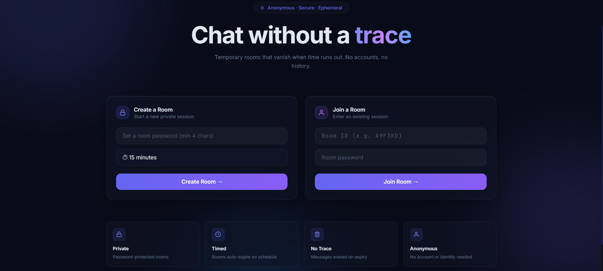
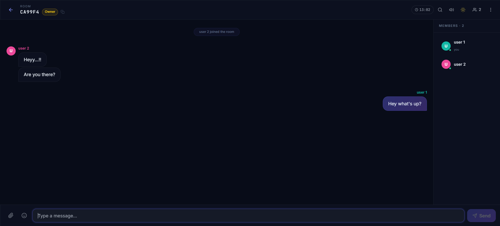

# ☕ TakeBreak

A real-time anonymous chat application where users can instantly create temporary password-protected chat rooms without registration.

🌐 **Live Demo:** https://takebreakk.vercel.app

---

## 📌 Overview

TakeBreak is a secure anonymous chat platform built using the MERN Stack and Socket.IO.

Users can:

- Create temporary chat rooms
- Protect rooms with passwords
- Join using Room ID + Password
- Share text, images, videos, and files
- Chat in real time
- Automatically delete rooms after expiry

No login or signup required.

---

## ✨ Features

### 🔐 Room Management

- Create anonymous rooms
- Password protected rooms
- Auto-generated Room IDs
- Configurable room duration
- Automatic room expiry

### 💬 Real-Time Chat

- Instant messaging using Socket.IO
- Typing indicator
- Join/Leave notifications
- System messages
- Auto-scroll

### 📁 Media Sharing

- Image Upload
- Video Upload
- File Upload
- Cloudinary Integration
- Instant media preview

### 👥 User Experience

- Responsive Design
- Light/Dark Theme
- Modern UI
- Mobile Friendly
- Toast Notifications

---

# 🛠 Tech Stack

## Frontend

- React
- Vite
- Tailwind CSS
- React Router
- Axios
- Socket.IO Client

## Backend

- Node.js
- Express.js
- MongoDB
- Mongoose
- Socket.IO
- Multer
- Cloudinary

## Deployment

- Vercel
- Render
- MongoDB Atlas

---

# 📂 Project Structure

```
TakeBreak
│
├── frontend
│   ├── src
│   ├── public
│   └── package.json
│
└── backend
    ├── src
    ├── config
    ├── controllers
    ├── models
    ├── routes
    ├── services
    ├── sockets
    └── package.json
```

---

# 🚀 Installation

## Clone Repository

```bash
git clone https://github.com/lokesh040306/TakeBreakk.git
```

---

## Backend

```bash
cd backend
npm install
npm run dev
```

---

## Frontend

```bash
cd frontend
npm install
npm run dev
```

---

# 🔑 Environment Variables

## Backend

Create `.env`

```env
PORT=

NODE_ENV=

MONGO_URI=

CLIENT_URL=

CLOUDINARY_CLOUD_NAME=

CLOUDINARY_API_KEY=

CLOUDINARY_API_SECRET=
```

---

## Frontend

```env
VITE_API_URL=

VITE_SOCKET_URL=
```

---

# 📸 Screenshots

### Home Page



---

### Chat Room



---

# ⚙️ Architecture

```
React (Vercel)
        │
        │ REST API + Socket.IO
        ▼
Node.js + Express (Render)
        │
        ├──────── MongoDB Atlas
        │
        └──────── Cloudinary
```

---

# 🔄 Application Flow

1. Create Room
2. Generate Room ID
3. Join Room
4. Authenticate Password
5. Connect Socket
6. Send Messages
7. Upload Files
8. Store Messages
9. Broadcast to Room
10. Auto Delete Room on Expiry

---

# 🎯 Key Highlights

- Anonymous Communication
- Password Protected Rooms
- Temporary Chat Sessions
- Real-Time Messaging
- Cloud File Storage
- Mobile Responsive
- Production Deployment

---

# 📚 Future Improvements

- Emoji Reactions
- Message Reply
- Voice Messages
- Read Receipts
- Online Presence
- Push Notifications
- Admin Controls

---

# 👨‍💻 Author

**Lokesh Dilip Bandurkar**

Software Developer

GitHub:
https://github.com/lokesh040306

---

# ⭐ If you like this project

Please consider giving it a ⭐ on GitHub.
